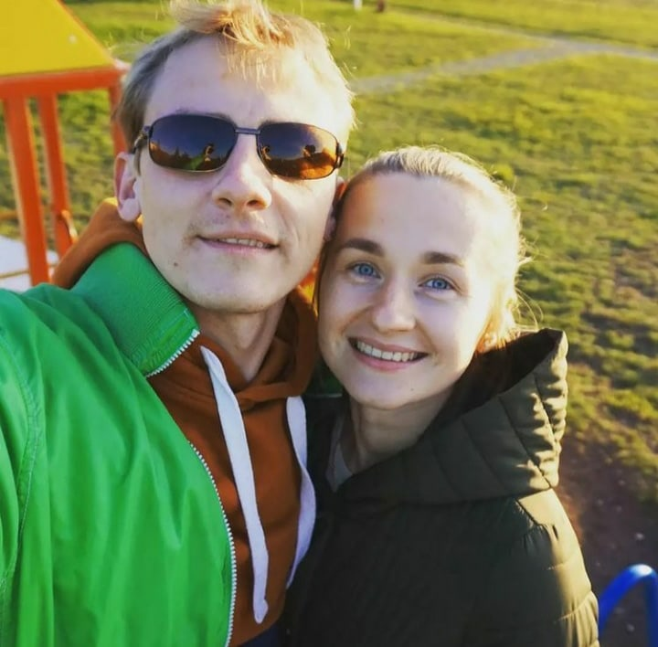

# Curriculum vitae (CV)

## 

---

# Radyna Pavel

## My contacts

- https://avminsk.by
- https://www.instagram.com/avtoelektrik_minsk/
- mologruz@gmail.com
- +375 (29) 7043273
- discord: Pavel Radyna#2662

## About myself

_Hi there! My name is Pavel and I decided to learn programming. I'm going to be a developer._  
_I'm 33 years old and I was born in Belarus, near Minsk (Molodechno city)._
_I am married and_  
_have two sons. Actually, I got a musical education and I was playing on the piano at the college._  
_It was so great) After that, I entered the institute (faculty of computer music). I worked as a_  
_musical teacher, then I started working as a commercial director in the Night Club 'Клаб'._  
_I wanted to start my own business and I was working as an entrepreneur. Also 3 years ago_  
_I got a new profession as an auto electrician. It is a very interesting stuff, but so physically_  
_difficult. Because of this I want to try programming. Let's go ahead)_

## My skills

I started to learn Html, Css and English on March 2022, so I keep learning)
